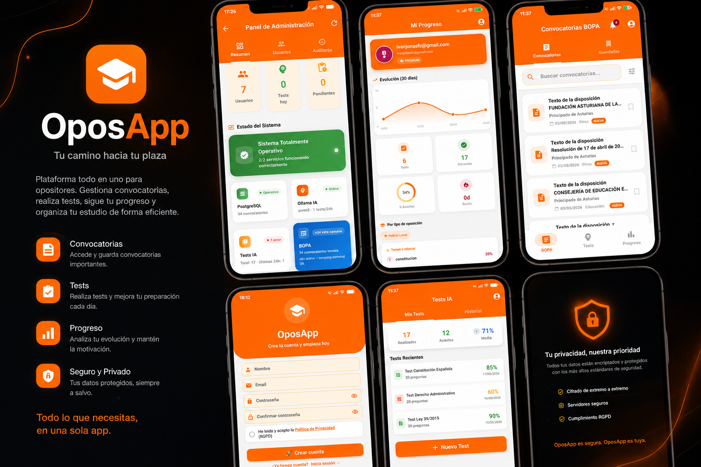
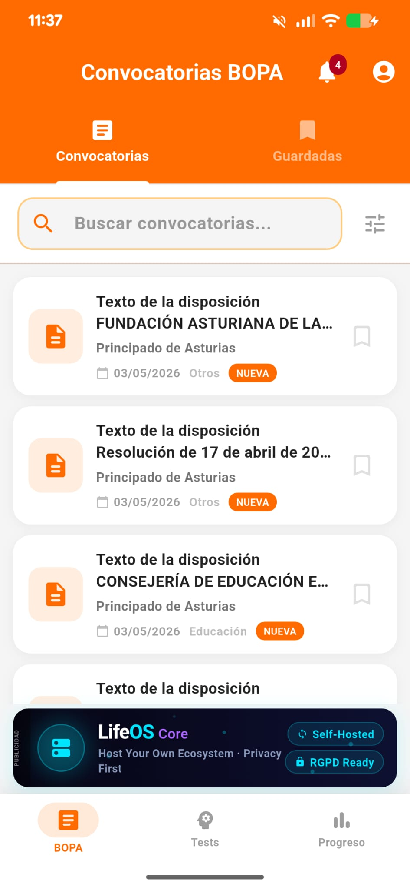
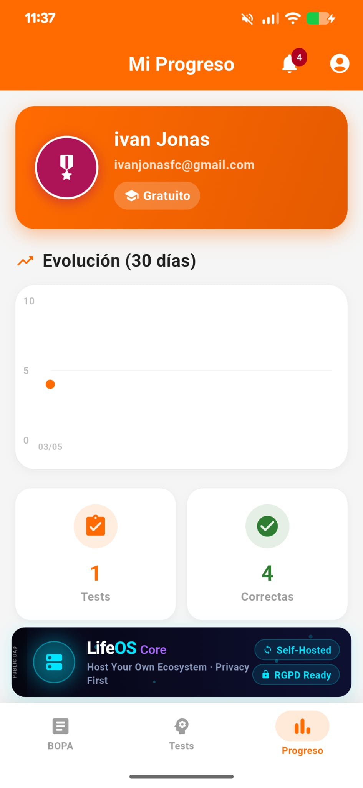
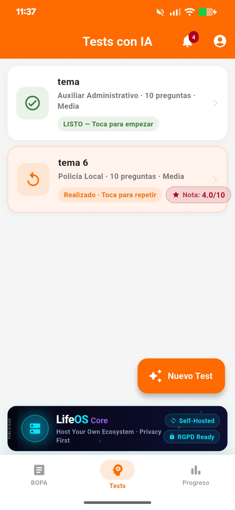
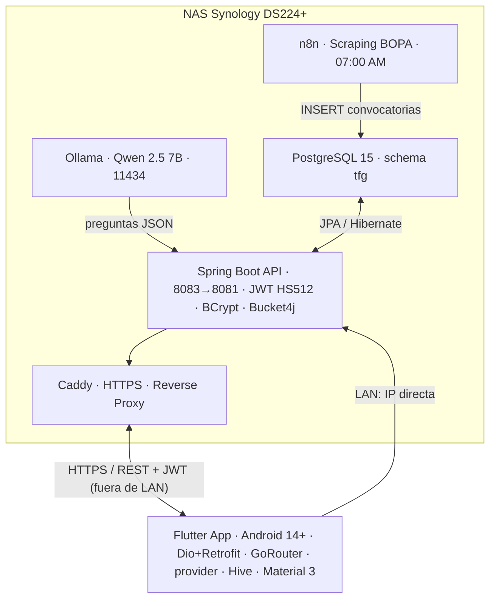

<div align="center">



# OposApp

**Seguimiento automático del BOPA y tests de práctica con IA local — con privacidad total.**

[](https://flutter.dev)
[](https://spring.io/projects/spring-boot)
[](https://openjdk.org)
[](https://www.postgresql.org)
[](https://ollama.com)
[](LICENSE)
[](https://portfolio.ivanjonasfc.dev/proyectos/oposapp/)

</div>

---

## ¿Qué es OposApp?

Aplicación móvil para opositores que resuelve dos problemas reales del opositor medio en Asturias: los **15-30 min diarios** buscando convocatorias a mano y los **50-150 €/mes** de las academias.

Automatiza el scraping del [BOPA](https://www.asturias.es/bopa) cada 24 h y usa un modelo de **IA local** (Ollama + Qwen 2.5 7B) para generar tests personalizados en ~11 s — **sin enviar ningún dato a servicios externos**. Todo corre en infraestructura propia, cumpliendo el RGPD por diseño.

> **Un único APK para dos entornos.** Al arrancar, la app detecta si el NAS es alcanzable en la red local (`192.168.0.200:8083`) y usa la IP directa; si no, cae automáticamente al dominio HTTPS externo. El mismo binario funciona dentro y fuera de la LAN sin recompilar.

Es mi **Trabajo de Fin de Grado** (DAM). Ficha completa en el [portfolio](https://portfolio.ivanjonasfc.dev/proyectos/oposapp/).

## Características

- **Convocatorias BOPA** — scraping diario automatizado (n8n · 07:00), filtros y búsqueda full-text tolerante a erratas
- **Tests con IA local** — generación asíncrona (`solicitudId` + polling) y corrección con explicación por pregunta
- **Dashboard de progreso** — KPIs, gráficos `fl_chart`, racha e historial · modo offline con caché Hive
- **Seguridad y RGPD** — JWT HS512, BCrypt, rate limiting · exportación y borrado de cuenta (Art. 17/20)
- **Panel de administración** — usuarios, estado de servicios (PostgreSQL, Ollama) y registro de auditoría

## Capturas

<table>
  <tr>
    <td align="center"><b>Convocatorias BOPA</b><br/></td>
    <td align="center"><b>Progreso</b><br/></td>
    <td align="center"><b>Tests con IA</b><br/></td>
  </tr>
</table>

## Arquitectura



## Stack tecnológico

**Frontend** Flutter 3.24 · Dio + Retrofit · GoRouter · provider · Hive (offline) · fl_chart · Material 3 (`#FF6B00`)
**Backend** Spring Boot 3 · Java 21 · PostgreSQL 15 · Spring Security (JWT HS512 + BCrypt) · Bucket4j · OpenAPI
**Automatización e IA** n8n (scraping) · Ollama + Qwen 2.5 7B · Caddy (HTTPS)

<details>
<summary>Ver detalle del stack</summary>

### Backend

| Componente                      | Detalle                                                                                           |
| ------------------------------- | ------------------------------------------------------------------------------------------------- |
| **Spring Boot 3.x**             | API RESTful stateless, arquitectura en capas estricta (Controller → Service → Repository → Model) |
| **Java 21**                     | Compilación y ejecución, gestionado con Gradle                                                    |
| **PostgreSQL 15**               | Base de datos relacional, schema `tfg`, `ddl-auto=none` para migraciones manuales                 |
| **Spring Security + JWT HS512** | Autenticación stateless, tokens de 7 días con claims `usuarioId`, `email` y `rol`                 |
| **BCryptPasswordEncoder**       | Hashing de contraseñas con factor de coste 12                                                     |
| **Bucket4j**                    | Rate limiting por Token Bucket — 30 req/min por IP, responde HTTP 429 si se supera                |
| **SpringDoc OpenAPI**           | Swagger UI autogenerado en `/swagger-ui.html`                                                     |
| **JavaMailSender + Thymeleaf**  | Emails transaccionales (confirmación de registro, recuperación de contraseña)                     |

### Frontend

| Componente                   | Detalle                                                                          |
| ---------------------------- | -------------------------------------------------------------------------------- |
| **Flutter 3.24**             | Android 14.0+, un único código base (compila también para web)                   |
| **Dio + Retrofit**           | Cliente HTTP con interceptor JWT global y cliente tipado                          |
| **GoRouter**                 | Enrutado declarativo con redirecciones según el estado de autenticación          |
| **provider**                 | Gestión de estado reactivo siguiendo el patrón ViewModel                         |
| **flutter_secure_storage**   | Almacenamiento seguro del token en el Keystore nativo del dispositivo             |
| **Hive**                     | Caché local clave-valor para modo offline (últimas convocatorias)                |
| **connectivity_plus / network_info_plus** | Detección de red y de IP local — base de la autodetección LAN/HTTPS  |
| **fl_chart + percent_indicator** | Gráficos de progreso (líneas, barras, anillos) con acento naranja            |
| **confetti / shimmer**       | Animación de resultados y microinteracciones de carga                            |
| **Material Design 3**        | `useMaterial3: true`, color semilla `#FF6B00`, tema claro                        |

### Automatización e IA

| Componente                        | Detalle                                                                       |
| --------------------------------- | ----------------------------------------------------------------------------- |
| **n8n**                           | Workflow de scraping del BOPA, se dispara a las 07:00 AM (CET) todos los días |
| **Ollama + Qwen 2.5 7B (Q4_K_M)** | Generación de tests localmente, sin API de pago, sin salida de datos          |
| **Caddy Server**                  | Reverse proxy con certificados HTTPS automáticos (Let's Encrypt)              |

</details>

## Seguridad

- **JWT HS512** stateless (7 días), validado en cada petición por `JwtAuthenticationFilter`
- **BCrypt** (coste 12) — contraseñas nunca en texto plano
- **Rate limiting** (Bucket4j) — 30 req/min por IP, HTTP 429 si se supera
- **Bean Validation** en todos los DTOs · **JPA/Hibernate** (imposible inyección SQL)
- **Panel de administración** restringido a red local del NAS (LAN o WireGuard) + rol `ROLE_ADMIN`
- **RGPD** — consentimiento opt-in con timestamp, borrado (`DELETE /api/user/delete`) y exportación (`GET /api/user/export`)

## Métricas de rendimiento (medidas en pruebas)

| Métrica                                  | Objetivo | Resultado  |
| ---------------------------------------- | -------- | ---------- |
| Listado de convocatorias (200 registros) | < 500 ms | **187 ms** |
| Generación de test con IA (10 preguntas) | < 15 s   | **11,3 s** |
| Carga de pantalla inicial (4G)           | < 3 s    | **1,8 s**  |
| Login con verificación BCrypt            | < 500 ms | **312 ms** |

<details>
<summary>Estructura del proyecto</summary>

```text
OposApp/
├── api-backend/                      # Spring Boot API (Java 21 + Gradle)
│   └── src/main/java/es/ivanesco/oposapp/api/
│       ├── controllers/              # Un controlador por dominio (Auth, Test, Bopa, Admin, Ads...)
│       ├── services/                 # Lógica de negocio (TestService, OllamaService, AuthService...)
│       ├── repositories/             # JpaRepository por entidad
│       ├── models/                   # Entidades JPA (@Table(schema="tfg"))
│       ├── dtos/                     # Request / Response DTOs desacoplados
│       ├── config/                   # SecurityConfig, RateLimitFilter, JwtAuthenticationFilter
│       └── exceptions/               # GlobalExceptionHandler con @RestControllerAdvice
│
├── oposapp/                          # App Flutter (Android 14+)
│   └── lib/
│       ├── main.dart                 # MaterialApp.router + init (red, Hive) antes de runApp
│       ├── core/                     # constants (URLs/endpoints), routing (GoRouter), theme, errors
│       ├── screens/                  # splash, login, home, bopa, generate, tests, test, resultado, progreso, perfil, admin
│       ├── services/                 # api_service (Dio+JWT), auth_service, admin_service, network_service
│       ├── models/                   # usuario, convocatoria, pregunta, estadisticas, audit_log...
│       ├── widgets/                  # ad_banner_widget, app_toast, reporte_dialog
│       └── cache/                    # hive_cache.dart (modo offline)
│
├── base_datos/                       # Scripts SQL / schema tfg
├── assets/                           # Capturas y recursos
└── docker-compose.yml                # PostgreSQL 15 + n8n + Caddy
```

</details>

<details>
<summary>Cómo ejecutar el proyecto</summary>

**Requisitos:** Docker + Compose · Java 21 + Gradle · Flutter SDK 3.24 · Ollama con `qwen2.5:7b`.

```bash
# Backend
docker-compose up -d              # PostgreSQL + n8n + Caddy
cd api-backend && ./gradlew bootRun   # API en el puerto 8081
# Swagger: http://localhost:8081/swagger-ui.html

# Frontend
cd oposapp
flutter pub get
flutter run                       # emulador o dispositivo físico
```

> La URL del backend se resuelve en runtime en `ApiService.initialize()`: LAN → `192.168.0.200:8083`, fuera de LAN → dominio HTTPS externo. Para desarrollo en el propio PC usa `baseUrlLocal` (`http://localhost:8081/api`) en `api_constants.dart`.

</details>

<details>
<summary>Solución de problemas comunes</summary>

| Error                            | Causa probable                                                                    | Solución                                                          |
| -------------------------------- | --------------------------------------------------------------------------------- | ---------------------------------------------------------------- |
| App no recibe token tras login   | Interceptor Dio no adjunta `Authorization: Bearer`                                | Revisar `ApiService` y los logs del backend                      |
| App apunta al entorno equivocado | El NAS no responde en `192.168.0.200:8083` (autodetección LAN/HTTPS)              | Verificar que el NAS es alcanzable en la LAN                     |
| Timeout en generación de tests   | Ollama apagado o saturado                                                          | Verificar que Ollama responde en el puerto `11434`              |
| Error Hibernate 6 al arrancar    | Entidades sin `@Table(schema="tfg")` o `scale`/`precision` en campos no BigDecimal | Eliminar `scale`/`precision` de esos campos                     |
| Scraping del BOPA sin resultados | Fallo en algún nodo del workflow n8n                                              | Consultar la tabla de historial de scraping                     |

</details>

## Roadmap

- [ ] Expansión del scraping al BOE y otras Comunidades Autónomas
- [ ] Fine-tuning del modelo Qwen con datos reales de uso
- [ ] Simulacros cronometrados y modo competitivo
- [ ] Notificaciones push (FCM) por categoría
- [ ] Expansión a iOS y web
- [ ] Modelo B2B: licencias white-label para academias

---

## Autor

**Iván Jonás Fernández Correa** — TFG · Desarrollo de Aplicaciones Multiplataforma (DAM) · 2025-2026
Tutores: Delio Tolivia Cadrecha (PIDAM) · Mario Álvarez Fernández (PDAW)

[Portfolio](https://portfolio.ivanjonasfc.dev) · [LinkedIn](https://linkedin.com/in/ivanjonasfc)

## Licencia

Distribuido bajo licencia [MIT](LICENSE).
