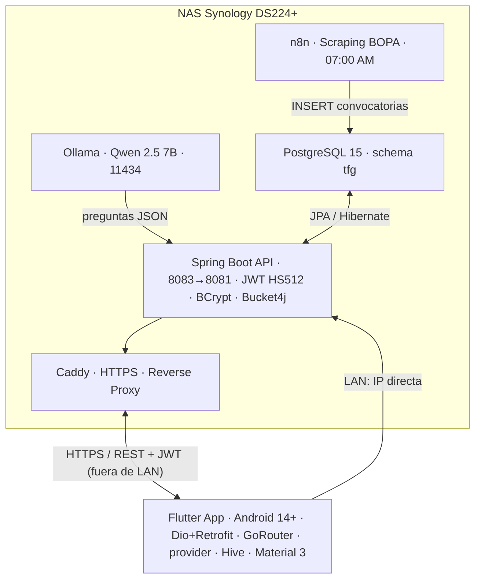

# OposApp

> Aplicación móvil para opositores que automatiza el seguimiento de convocatorias del BOPA y genera tests de práctica personalizados mediante IA local — con privacidad total garantizada.

[](https://flutter.dev)
[](https://spring.io/projects/spring-boot)
[](https://openjdk.org)
[](https://www.postgresql.org)
[](https://docs.docker.com)
[](LICENSE)
[](https://portfolio.ivanjonasfc.dev/proyectos/oposapp/)

---

## ¿Qué es OposApp?

OposApp resuelve dos problemas reales del opositor medio en Asturias:

- **15-30 minutos diarios** buscando manualmente convocatorias de empleo público
- **50-150 €/mes** de coste en academias tradicionales para preparar los exámenes

La app automatiza el scraping del [BOPA](https://www.asturias.es/bopa) cada 24 horas y usa un modelo de IA local (Ollama + Qwen 2.5 7B) para generar tests personalizados en menos de 15 segundos — **sin enviar ningún dato a servicios externos**. Todo el procesamiento ocurre en infraestructura propia, cumpliendo el RGPD por diseño.

> **Un único APK para dos entornos.** Al arrancar, la app comprueba si el NAS es alcanzable en la red local (`192.168.0.200:8083`); si lo es, usa la IP directa (más rápido, sin TLS); si no, cae automáticamente al dominio HTTPS externo (`https://opposapp.ivanjonasfc.dev/api`). El mismo binario funciona dentro y fuera de la LAN sin recompilar.

Este proyecto es mi **Trabajo de Fin de Grado** (DAM). Ficha completa en el [portfolio](https://portfolio.ivanjonasfc.dev/proyectos/oposapp/).

## Arquitectura del sistema



## Stack tecnológico

### Backend

| Componente                      | Detalle                                                                                           |
| ------------------------------- | ------------------------------------------------------------------------------------------------- |
| **Spring Boot 3.x**             | API RESTful stateless, arquitectura en capas estricta (Controller → Service → Repository → Model) |
| **Java 21**                     | Compilación y ejecución, gestionado con Gradle                                                    |
| **PostgreSQL 15**               | Base de datos relacional, schema `tfg`, `ddl-auto=none` para migraciones manuales                 |
| **Spring Security + JWT HS512** | Autenticación stateless, tokens de 7 días con claims `usuarioId`, `email` y `rol`                 |
| **BCryptPasswordEncoder**       | Hashing de contraseñas con factor de coste 12                                                     |
| **Bucket4j**                    | Rate limiting por Token Bucket — 30 req/min por IP, responde HTTP 429 si se supera                |
| **SpringDoc OpenAPI**           | Swagger UI autogenerado en `/swagger-ui.html`                                                     |
| **JavaMailSender + Thymeleaf**  | Emails transaccionales (confirmación de registro, recuperación de contraseña)                     |

### Frontend

| Componente                   | Detalle                                                                                       |
| ---------------------------- | --------------------------------------------------------------------------------------------- |
| **Flutter 3.24**             | Android 14.0+, un único código base (compila también para web)                                |
| **Dio + Retrofit**           | Cliente HTTP con interceptor JWT global y cliente tipado                                       |
| **GoRouter**                 | Enrutado declarativo con redirecciones según el estado de autenticación                        |
| **provider**                 | Gestión de estado reactivo siguiendo el patrón ViewModel                                       |
| **flutter_secure_storage**   | Almacenamiento seguro del token en el Keystore nativo del dispositivo                          |
| **Hive**                     | Caché local clave-valor para **modo offline** (últimas convocatorias)                         |
| **connectivity_plus / network_info_plus** | Detección de red y de IP local — base de la autodetección LAN/HTTPS              |
| **fl_chart + percent_indicator** | Gráficos de progreso (líneas, barras, anillos) con acento naranja                         |
| **confetti / shimmer / staggered_animations** | Animación de resultados y microinteracciones de carga                        |
| **Material Design 3**        | `useMaterial3: true`, color semilla `#FF6B00`, tema claro                                      |

### Automatización e IA

| Componente                          | Detalle                                                                       |
| ----------------------------------- | ----------------------------------------------------------------------------- |
| **n8n**                             | Workflow de scraping del BOPA, se dispara a las 07:00 AM (CET) todos los días |
| **Ollama + Qwen 2.5 7B (Q4_K_M)**   | Generación de tests localmente, sin API de pago, sin salida de datos          |
| **Caddy Server**                    | Reverse proxy con certificados HTTPS automáticos (Let's Encrypt)              |

---

## Funcionalidades principales

### Convocatorias BOPA

- Scraping automatizado diario — sin intervención manual
- Filtros por categoría, organismo, fecha y estado (activa/cerrada)
- Búsqueda full-text con tolerancia a errores tipográficos
- Favoritos accesibles **offline** mediante caché local **Hive**

### Generación de tests con IA

- Configuración: categoría, número de preguntas (5–20) y dificultad (Baja/Media/Alta)
- Flujo asíncrono: el backend responde con `solicitudId` inmediatamente, Ollama procesa en segundo plano
- Flutter hace *polling* del estado de la solicitud hasta que el test está listo
- Corrección inmediata con explicación por pregunta generada por la IA
- Tiempo de generación medido: **11,3 s** para 10 preguntas (límite establecido: 15 s)

### Dashboard de progreso

- KPIs en tiempo real: tests completados, aciertos, racha de días
- Gráfico de línea con la evolución de los últimos tests
- Historial completo ordenable por fecha/puntuación

### Panel de administración (rol `ROLE_ADMIN`)

- Métricas de usuarios y tests, estado de servicios (PostgreSQL, Ollama)
- Registro de **auditoría** de acciones
- Estado del scraping semanal del BOPA

### RGPD (Privacy by Design)

- Checkbox obligatorio no pre-marcado en el registro, con log de timestamp de consentimiento
- `DELETE /api/user/delete` — borrado completo e irreversible de la cuenta (Art. 17)
- `GET /api/user/export` — exportación JSON del perfil e historial (Art. 20)

### Modelo Freemium

|                         | Gratuito                                     | Premium (7 €/mes · 70 €/año) |
| ----------------------- | -------------------------------------------- | ---------------------------- |
| Convocatorias BOPA      | ✅                                            | ✅                            |
| Tests ilimitados con IA | ✅                                            | ✅                            |
| Dashboard de progreso   | ✅                                            | ✅                            |
| Publicidad              | Banner inferior + interstitial cada 10 tests | ❌ Sin publicidad             |
| Modelo IA               | Estándar                                     | Optimizado                   |
| Soporte                 | —                                            | SLA 12 horas                 |
| Roadmap                 | —                                            | Voto en funcionalidades      |

---

## Estructura del proyecto

```text
OposApp/
├── api-backend/                      # Spring Boot API (Java 21 + Gradle)
│   └── src/main/java/es/ivanesco/oposapp/api/
│       ├── controllers/              # Un controlador por dominio (Auth, Test, Bopa, Admin, Ads...)
│       ├── services/                 # Lógica de negocio (TestService, OllamaService, AuthService...)
│       ├── repositories/             # JpaRepository por entidad
│       ├── models/                   # Entidades JPA (@Table(schema="tfg"))
│       ├── dtos/                     # Request / Response DTOs desacoplados
│       ├── config/                   # SecurityConfig, RateLimitFilter, JwtAuthenticationFilter
│       └── exceptions/               # GlobalExceptionHandler con @RestControllerAdvice
│
├── oposapp/                          # App Flutter (Android 14+)
│   └── lib/
│       ├── main.dart                 # MaterialApp.router + init (red, Hive) antes de runApp
│       ├── core/
│       │   ├── constants/            # api_constants.dart (URLs LAN/HTTPS, endpoints, timeouts)
│       │   ├── routing/              # app_router.dart (GoRouter, rutas y guardas)
│       │   ├── theme/                # app_colors.dart, app_theme.dart (seed #FF6B00)
│       │   └── errors/               # app_exception.dart
│       ├── screens/                  # splash, login, home, bopa, generate, tests, test, resultado, progreso, perfil, admin
│       ├── services/                 # api_service (Dio+JWT), auth_service, admin_service, network_service
│       ├── models/                   # usuario, convocatoria, pregunta, solicitud_generacion, estadisticas, audit_log...
│       ├── widgets/                  # ad_banner_widget, app_toast, reporte_dialog
│       └── cache/                    # hive_cache.dart (modo offline)
│
├── base_datos/                       # Scripts SQL / schema tfg
├── assets/                           # Recursos e imágenes
└── docker-compose.yml                # PostgreSQL 15 + n8n + Caddy
```

## Métricas de rendimiento (medidas en pruebas)

| Métrica                                  | Objetivo | Resultado  |
| ---------------------------------------- | -------- | ---------- |
| Listado de convocatorias (200 registros) | < 500 ms | **187 ms** |
| Generación de test con IA (10 preguntas) | < 15 s   | **11,3 s** |
| Carga de pantalla inicial (4G)           | < 3 s    | **1,8 s**  |
| Login con verificación BCrypt            | < 500 ms | **312 ms** |

---

## Seguridad implementada

- **JWT HS512** — tokens stateless de 7 días, validados en cada petición por `JwtAuthenticationFilter`
- **BCrypt (coste 12)** — contraseñas nunca almacenadas en texto plano
- **Rate limiting (Bucket4j)** — máx. 30 req/min por IP, HTTP 429 si se supera
- **CSRF deshabilitado** explícitamente (estándar en APIs REST stateless con JWT)
- **Bean Validation** en todos los DTOs de entrada — HTTP 400 si falla sin llegar a la lógica
- **SQL Injection** imposible — JPA/Hibernate genera siempre `PreparedStatement` con parámetros
- **Panel de administración** restringido a red local del NAS (LAN o túnel WireGuard) + rol `ROLE_ADMIN`

---

## Cómo ejecutar el proyecto

### Requisitos previos

- Docker y Docker Compose
- Java 21 + Gradle
- Flutter SDK 3.24
- Ollama con el modelo `qwen2.5:7b` instalado

### Backend

```bash
# 1. Levantar base de datos
docker-compose up -d

# 2. Compilar y ejecutar Spring Boot (puerto 8081)
cd api-backend
./gradlew bootRun

# 3. Documentación interactiva de la API
# http://localhost:8081/swagger-ui.html
```

### Frontend

```bash
cd oposapp

# Instalar dependencias
flutter pub get

# Ejecutar en emulador/dispositivo físico
flutter run

# Ejecutar en navegador (útil en desarrollo)
flutter run -d chrome
```

> La URL del backend se resuelve en runtime en `ApiService.initialize()`: LAN → `192.168.0.200:8083`, fuera de LAN → `https://opposapp.ivanjonasfc.dev/api`. Para desarrollo local en el propio PC, usa `baseUrlLocal` (`http://localhost:8081/api`) en `api_constants.dart`.

### Producción (NAS Synology)

```bash
# Levanta PostgreSQL, n8n y Caddy
docker-compose up -d

# Spring Boot desplegado en el NAS (Docker 8083 → 8081 interno)
# Ollama accesible en la red local (puerto 11434)
# Caddy gestiona HTTPS y enrutamiento hacia opposapp.ivanjonasfc.dev
```

---

## Solución de problemas comunes

| Error                            | Causa probable                                                                                      | Solución                                                                |
| -------------------------------- | --------------------------------------------------------------------------------------------------- | ----------------------------------------------------------------------- |
| App no recibe token tras login   | Interceptor Dio no adjunta `Authorization: Bearer`                                                  | Revisar `ApiService` y los logs del backend                             |
| App apunta al entorno equivocado | Autodetección LAN/HTTPS: el NAS no responde en `192.168.0.200:8083`                                  | Verificar que el NAS es alcanzable en la LAN; si no, usará el HTTPS externo |
| Timeout en generación de tests   | Ollama apagado o saturado                                                                            | Verificar que Ollama responde en el puerto `11434` desde la red local   |
| Error Hibernate 6 al arrancar    | Entidades sin `@Table(schema="tfg")` o campos `Double`/`Float` con `scale`/`precision` en `@Column` | Eliminar `scale`/`precision` de campos no `BigDecimal`                   |
| Scraping del BOPA sin resultados | Fallo en algún nodo del workflow n8n                                                                | Consultar la tabla de historial de scraping para localizar el fallo     |

---

## Roadmap

- [ ] Expansión del scraping al BOE y otras Comunidades Autónomas
- [ ] Fine-tuning del modelo Qwen con datos reales de uso
- [ ] Simulacros cronometrados y modo competitivo
- [ ] Notificaciones push (FCM) para nuevas convocatorias por categoría
- [ ] Expansión a iOS y web (Flutter permite compilación directa)
- [ ] Modelo B2B: licencias white-label para academias

---

## Autor

**Iván Jonás Fernández Correa**
TFG — Desarrollo de Aplicaciones Multiplataforma (DAM) · Curso 2025-2026
Tutores: Delio Tolivia Cadrecha (PIDAM) · Mario Álvarez Fernández (PDAW)

- Portfolio: https://portfolio.ivanjonasfc.dev
- LinkedIn: https://linkedin.com/in/ivanjonasfc

---

## Licencia

Este proyecto se distribuye bajo la licencia [MIT](LICENSE).
