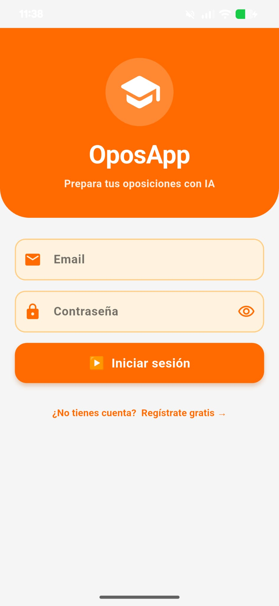
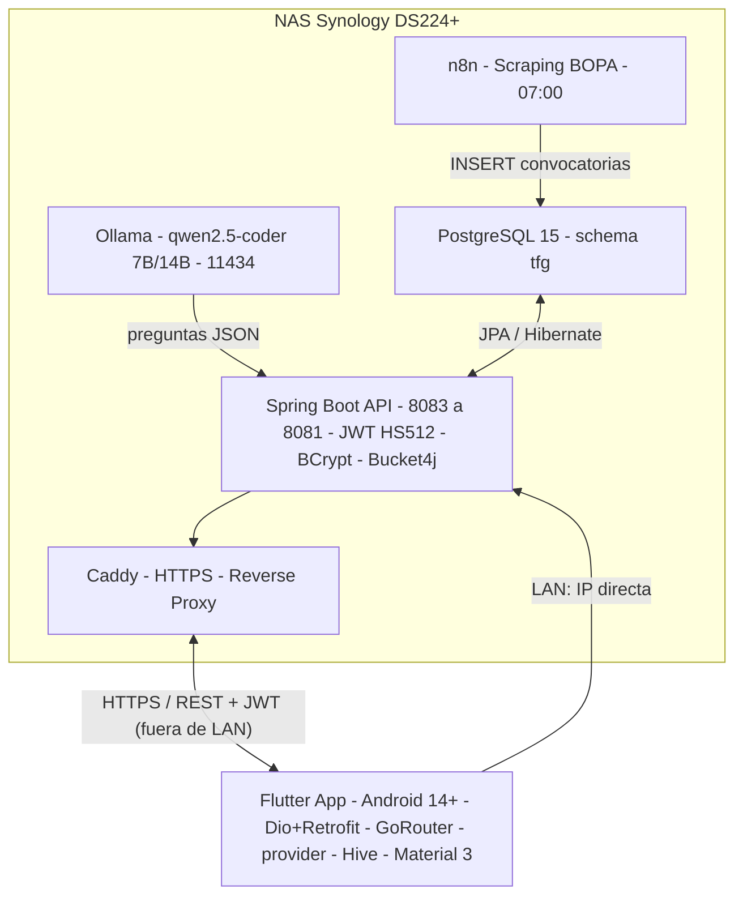

<div align="center">

# OposApp

**Seguimiento automático del BOPA y tests de práctica con IA local, con privacidad total.**

[](https://flutter.dev)
[](https://spring.io/projects/spring-boot)
[](https://openjdk.org)
[](https://www.postgresql.org)
[](https://ollama.com)
[](LICENSE)
[](https://portfolio.ivanjonasfc.dev/proyectos/oposapp/)


</div>

---

## Qué es OposApp

Aplicación móvil para opositores que resuelve dos problemas reales del opositor medio en Asturias: los **15-30 min diarios** buscando convocatorias a mano y los **50-150 EUR/mes** de las academias.

Automatiza el scraping del [BOPA](https://www.asturias.es/bopa) cada 24 h y usa un modelo de **IA local** (Ollama + `qwen2.5-coder`, 7B en el tier gratuito y 14B en el premium) para generar tests personalizados en ~11 s, **sin enviar ningún dato a servicios externos**. Todo corre en infraestructura propia, cumpliendo el RGPD por diseño.

> **Un único APK para dos entornos.** Al arrancar, la app detecta si el NAS es alcanzable en la red local y usa la IP directa; si no, cae automáticamente al dominio HTTPS externo. El mismo binario funciona dentro y fuera de la LAN sin recompilar.

Es mi **Trabajo de Fin de Grado** (DAM). Ficha completa en el [portfolio](https://portfolio.ivanjonasfc.dev/proyectos/oposapp/).

## Características

- **Convocatorias BOPA** — scraping diario automatizado (n8n, 07:00), filtros y búsqueda full-text tolerante a erratas.
- **Tests con IA local** — generación asíncrona (`solicitudId` + polling) y corrección con explicación por pregunta.
- **Dashboard de progreso** — KPIs, gráficos `fl_chart`, racha e historial; modo offline con caché Hive.
- **Seguridad y RGPD** — JWT HS512, BCrypt, rate limiting; exportación y borrado de cuenta (Art. 17/20).
- **Panel de administración** — usuarios, estado de servicios (PostgreSQL, Ollama) y registro de auditoría.

## Capturas

<table>
  <tr>
    <td align="center"><b>Login</b><br/></td>
    <td align="center"><b>Convocatorias BOPA</b><br/></td>
    <td align="center"><b>Panel de administración</b><br/></td>
  </tr>
</table>

## Arquitectura



## Stack tecnológico

**Frontend** — Flutter 3.24, Dio + Retrofit, GoRouter, provider, Hive (offline), fl_chart, Material 3 (`#FF6B00`).
**Backend** — Spring Boot 3, Java 21, PostgreSQL 15, Spring Security (JWT HS512 + BCrypt), Bucket4j, OpenAPI.
**Automatización e IA** — n8n (scraping), Ollama + qwen2.5-coder (7B free / 14B premium), Caddy (HTTPS).

> **Servicios externos (no incluidos en el repositorio):** Ollama, n8n, PostgreSQL y Caddy corren en el NAS o en tu host. El repo contiene la app Flutter, la API Spring Boot, los scripts de base de datos y el workflow de n8n exportado; Ollama y sus modelos se instalan aparte (ver *Cómo ejecutar el proyecto*).

<details>
<summary>Ver detalle del stack</summary>

### Backend

| Componente | Detalle |
| --- | --- |
| **Spring Boot 3.x** | API RESTful stateless, arquitectura en capas estricta (Controller → Service → Repository → Model). |
| **Java 21** | Compilación y ejecución, gestionado con Gradle. |
| **PostgreSQL 15** | Base de datos relacional, schema `tfg`, `ddl-auto=validate` en producción. |
| **Spring Security + JWT HS512** | Autenticación stateless, tokens de 7 días con claims `usuarioId`, `email` y `rol`. |
| **BCryptPasswordEncoder** | Hashing de contraseñas con factor de coste 12. |
| **Bucket4j** | Rate limiting por Token Bucket (30 req/min por IP, HTTP 429 al superarlo). |
| **SpringDoc OpenAPI** | Swagger UI autogenerado en `/swagger-ui.html`. |
| **JavaMailSender + Thymeleaf** | Emails transaccionales (confirmación de registro, recuperación de contraseña). |

### Frontend

| Componente | Detalle |
| --- | --- |
| **Flutter 3.24** | Android 14.0+, un único código base (compila también para web). |
| **Dio + Retrofit** | Cliente HTTP con interceptor JWT global y cliente tipado. |
| **GoRouter** | Enrutado declarativo con redirecciones según el estado de autenticación. |
| **provider** | Gestión de estado reactivo siguiendo el patrón ViewModel. |
| **flutter_secure_storage** | Token en el Keystore nativo del dispositivo. |
| **Hive** | Caché local clave-valor para modo offline (últimas convocatorias). |
| **connectivity_plus / network_info_plus** | Detección de red e IP local, base de la autodetección LAN/HTTPS. |
| **fl_chart + percent_indicator** | Gráficos de progreso (líneas, barras, anillos) con acento naranja. |
| **Material Design 3** | `useMaterial3: true`, color semilla `#FF6B00`, tema claro. |

### Automatización e IA

| Componente | Detalle |
| --- | --- |
| **n8n** | Workflow de scraping del BOPA, se dispara a las 07:00 (CET) todos los días. |
| **Ollama + qwen2.5-coder** | Generación de tests en local (7B en el tier gratuito, 14B en premium). Sin API de pago, sin salida de datos. El JSON se pide por prompt (`format=null`, temperatura 0.3). |
| **Caddy Server** | Reverse proxy con certificados HTTPS automáticos (Let's Encrypt). |

</details>

## Seguridad

- **JWT HS512** stateless (7 días), validado en cada petición por `JwtAuthenticationFilter`.
- **BCrypt** (coste 12): las contraseñas nunca se almacenan en texto plano.
- **Rate limiting** (Bucket4j): 30 req/min por IP, HTTP 429 al superarlo.
- **Bean Validation** en todos los DTOs; **JPA/Hibernate** (parámetros vinculados, sin inyección SQL).
- **Panel de administración** restringido a la red local del NAS (LAN o WireGuard) y al rol `ROLE_ADMIN`.
- **RGPD**: consentimiento opt-in con timestamp, borrado (`DELETE /api/user/delete`) y exportación (`GET /api/user/export`).
- **Secretos fuera del repositorio**: `application.yml`, `application-nas.yml`, `application-local.yml` y `.env` están en `.gitignore`; solo se versionan las plantillas `*.example`.

## Métricas de rendimiento (medidas en pruebas)

| Métrica | Objetivo | Resultado |
| --- | --- | --- |
| Listado de convocatorias (200 registros) | < 500 ms | **187 ms** |
| Generación de test con IA (10 preguntas) | < 15 s | **11,3 s** |
| Carga de pantalla inicial (4G) | < 3 s | **1,8 s** |
| Login con verificación BCrypt | < 500 ms | **312 ms** |

<details>
<summary>Estructura del proyecto</summary>

```text
OposApp/
├── api-backend/                      # Spring Boot API (Java 21 + Gradle)
│   └── src/main/java/es/ivanesco/oposapp/api/
│       ├── controllers/              # Un controlador por dominio (Auth, Test, Bopa, Admin, Ads...)
│       ├── services/                 # Lógica de negocio (TestService, OllamaService, AuthService...)
│       ├── repositories/             # JpaRepository por entidad
│       ├── models/                   # Entidades JPA (@Table(schema="tfg"))
│       ├── dtos/                     # Request / Response DTOs desacoplados
│       ├── config/                   # SecurityConfig, RateLimitFilter, JwtAuthenticationFilter
│       └── exceptions/               # GlobalExceptionHandler con @RestControllerAdvice
│
├── oposapp/                          # App Flutter (Android 14+)
│   └── lib/
│       ├── main.dart                 # MaterialApp.router + init (red, Hive) antes de runApp
│       ├── core/                     # constants (URLs/endpoints), routing (GoRouter), theme, errors
│       ├── screens/                  # splash, login, home, bopa, generate, tests, test, resultado, progreso, perfil, admin
│       ├── services/                 # api_service (Dio+JWT), auth_service, admin_service, network_service
│       ├── models/                   # usuario, convocatoria, pregunta, estadisticas, audit_log...
│       ├── widgets/                  # ad_banner_widget, app_toast, reporte_dialog
│       └── cache/                    # hive_cache.dart (modo offline)
│
├── base_datos/                       # 01_schema.sql, 02_datos_muestra.sql, n8n_workflow_bopa_v2.json
├── assets/                           # Capturas de la app
├── .env.example                      # Plantilla de variables de entorno (perfil NAS)
├── docker-compose.yml                # Despliegue del backend en el NAS
└── Despliegue.md                     # Guía de despliegue paso a paso
```

</details>

<details>
<summary>Cómo ejecutar el proyecto</summary>

**Requisitos:** Java 21 + Gradle, Flutter SDK 3.24, PostgreSQL 15 y Ollama.

1) IA local (Ollama) — se instala aparte, no está en el repo:

```bash
ollama pull qwen2.5-coder:7b-instruct                 # modelo gratuito
# opcional (premium): ollama pull qwen2.5-coder:14b-instruct-q3_K_M
```

2) Base de datos (schema `tfg`):

```bash
createdb tfg_db
psql -d tfg_db -f base_datos/01_schema.sql
psql -d tfg_db -f base_datos/02_datos_muestra.sql     # datos de ejemplo (opcional)
```

3) Backend:

```bash
cd api-backend
cp src/main/resources/application.yml.example src/main/resources/application.yml   # rellena tus valores
./gradlew bootRun --args='--spring.profiles.active=local'
# API en http://localhost:8081 · Swagger: http://localhost:8081/swagger-ui.html
```

4) Frontend:

```bash
cd oposapp
flutter pub get
flutter run
```

5) Scraping del BOPA (opcional): importa `base_datos/n8n_workflow_bopa_v2.json` en tu instancia de n8n.

Despliegue en el NAS (perfil `nas`):

```bash
cp .env.example .env      # rellena los secretos reales
docker compose up -d --build
```

> La URL del backend se resuelve en runtime en `ApiService.initialize()`: en LAN usa la IP local del NAS y, fuera de la LAN, el dominio HTTPS. Para dev en el propio PC usa `baseUrlLocal` (`http://localhost:8081/api`) en `api_constants.dart`.

</details>

<details>
<summary>Solución de problemas comunes</summary>

| Error | Causa probable | Solución |
| --- | --- | --- |
| App no recibe token tras login | El interceptor Dio no adjunta `Authorization: Bearer` | Revisar `ApiService` y los logs del backend |
| App apunta al entorno equivocado | El NAS no responde en la red local | Verificar que el NAS es alcanzable en la LAN |
| Timeout en generación de tests | Ollama apagado o saturado | Verificar que Ollama responde en el puerto `11434` |
| Error de Hibernate 6 al arrancar | Entidades sin `@Table(schema="tfg")` o `scale`/`precision` en campos no `BigDecimal` | Eliminar `scale`/`precision` de esos campos |
| Scraping del BOPA sin resultados | Fallo en algún nodo del workflow n8n | Consultar la tabla de historial de scraping |

</details>


---

## Autor

**Iván Jonás Fernández Correa** — TFG, Desarrollo de Aplicaciones Multiplataforma (DAM), 2025-2026.
Tutores: Delio Tolivia Cadrecha (PIDAM) y Mario Álvarez Fernández (PDAW).

<p>
  <a href="https://portfolio.ivanjonasfc.dev/proyectos/oposapp/"></a>
  <a href="https://www.linkedin.com/in/ivanjonasfc/"></a>
</p>

## Licencia

Distribuido bajo licencia [MIT](LICENSE).
